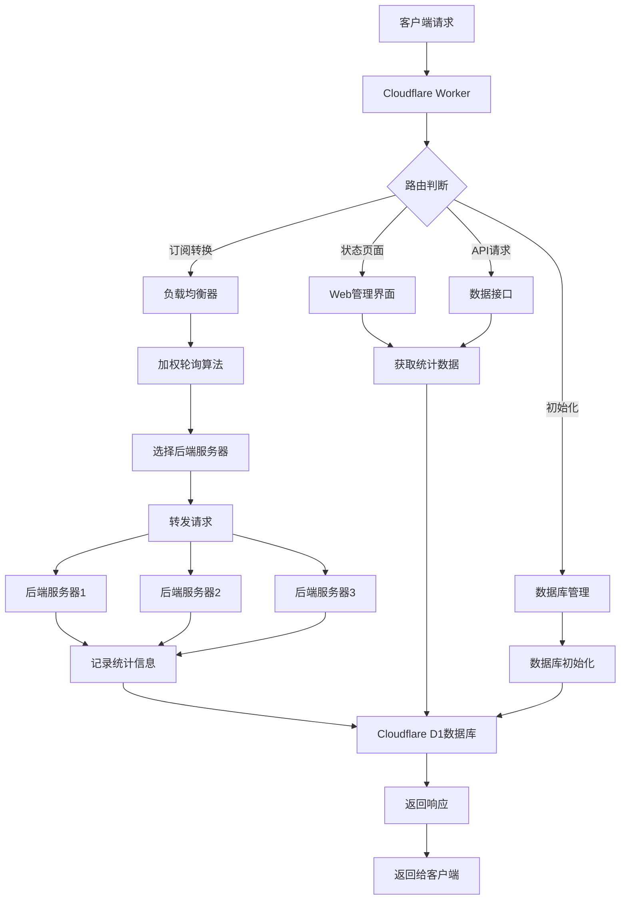

# 🚀 Subconverter Load Balancer

一个基于 Cloudflare Workers 的订阅转换负载均衡系统，提供智能加权轮询、实时监控和性能统计功能。


## 📋 目录

- [📖 项目简介](#项目简介)
- [✨ 功能特性](#功能特性)
- [🏗️ 系统架构](#系统架构)
- [🚀 快速开始](#快速开始)
- [⚙️ 配置说明](#配置说明)
- [🖥️ 管理界面](#管理界面)
- [📊 API接口](#api接口)
- [🔧 部署指南](#部署指南)
- [📝 故障排除](#故障排除)
- [🤝 贡献指南](#贡献指南)
- [📄 许可证](#许可证)

## 📖 项目简介

Subconverter Load Balancer 是一个部署在 Cloudflare Workers 上的智能负载均衡系统，专门为订阅转换服务设计。系统通过加权轮询算法智能分发请求到多个后端服务器，并提供实时监控、性能统计和故障转移功能。

## 🎯 核心目标
- **高可用性**：自动检测后端服务器健康状态
- **智能负载均衡**：基于动态权重的请求分发
- **实时监控**：全面的性能指标和请求日志
- **易于管理**：直观的Web管理界面

## ✨ 功能特性

### 🔄 智能负载均衡
- **加权轮询算法**：基于服务器权重智能分发请求
- **动态权重调整**：根据请求成功率自动调整权重
- **故障检测**：自动标记不可用服务器
- **健康检查**：实时监控后端服务器状态

### 📊 实时监控
- **服务器状态监控**：实时显示所有后端服务器状态
- **请求统计**：成功率、响应时间、请求数量统计
- **历史日志**：保留最近100条请求记录
- **性能指标**：平均响应时间、动态权重变化

### 🖥️ 管理界面
- **状态仪表盘**：美观的实时监控界面
- **数据库管理**：一键初始化/重置数据库
- **移动端适配**：完全响应式设计
- **调试模式**：详细的系统调试信息

### ⚙️ 配置管理
- **默认后端配置**：预设多个稳定的后端服务器
- **权重参数可调**：成功/失败权重调整幅度可配置
- **CORS支持**：完整的跨域资源共享支持
- **缓存控制**：智能的缓存策略

## 🏗️ 系统架构



### 📦 组件说明

| 组件 | 功能 | 技术栈 |
| :--- | :--- | :--- |
| **负载均衡器** | 请求分发和权重管理 | Cloudflare Workers |
| **数据库层** | 存储配置和统计信息 | Cloudflare D1 (SQLite) |
| **管理界面** | 系统监控和配置 | HTML5 + CSS3 + JS |
| **后端服务器** | 订阅转换服务 | 多个公共/私有后端 |

---

## 🚀 快速开始

### 前提条件

* Cloudflare 账户
* 安装 Wrangler CLI
* Node.js 18+ 环境

### 部署步骤

1. 克隆项目

```bash
git clone <repository-url>
cd subconverter-loadbalancer
```

2. 安装依赖

```bash
npm install
```

3. 配置数据库

```bash
# 创建 D1 数据库
wrangler d1 create subconverter-db
```

4. 更新配置
   编辑wrangler.toml，替换数据库ID：

```toml
[[d1_databases]]
binding = "DB"
database_name = "subconverter-db"
database_id = "your-database-id-here"
```

5. 部署到 Cloudflare

```bash
# 开发预览
npm run dev

# 生产部署
npm run deploy
```

## 初始化系统

1. 访问部署后的 Worker URL
2. 系统会自动重定向到初始化页面
3. 点击"初始化数据库"按钮
4. 等待初始化完成，自动跳转到状态监控页面

### ⚙️ 配置说明

### 核心配置参数

* 在 worker.js 中可调整以下参数：

```javascript
// 默认后端服务器地址
const DEFAULT_BACKENDS = [
  'https://xx.xx.xx',
  'https://xx.xx.xx',
  'https://xx.xx.xx'
];

// 权重配置
const INITIAL_WEIGHT = 10;        // 初始权重
const SUCCESS_WEIGHT_INCREMENT = 1; // 成功时权重增加
const FAILURE_WEIGHT_DECREMENT = 2; // 失败时权重减少
const MAX_WEIGHT = 20;            // 最大权重
const MIN_WEIGHT = 1;             // 最小权重
```

### 🛣️ 路由说明
| 路径 | 方法 | 功能 | 描述 |
|---|---|---|---|
| / | GET | 重定向 | 重定向到状态页面 |
| /status | GET | 状态页面 | 系统监控仪表盘 |
| /init | GET | 初始化页面 | 数据库初始化界面 |
| /sub* | GET/POST | 订阅转换 | 负载均衡转发请求 |
| /api/backend-stats | GET | 统计接口 | 获取后端服务器统计数据 |

### 🗃️ 数据库表结构

### 📊 backend_servers 表

| 字段 | 类型| 描述|
|---|---|---|
| id | INTEGER | 主键，自增|
| url | TEXT | 后端服务器地址|
| weight | INTEGER | 基础权重|
| dynamic_weight | REAL | 动态权重|
| total_requests | INTEGER | 总请求数|
| success_count | INTEGER | 成功次数|
| fail_count | INTEGER | 失败次数|
| average_response_time | REAL | 平均响应时间|
| last_response_time | REAL | 最后响应时间|
| last_used | TIMESTAMP | 最后使用时间|
| enabled | BOOLEAN | 是否启用|
| created_at | TIMESTAMP | 创建时间|
| updated_at | TIMESTAMP | 更新时间|

### 📝 request_logs 表

| 字段 | 类型 | 描述|
|---|---|---|
| id | INTEGER | 主键，自增|
| backend_url | TEXT | 后端服务器地址|
| response_time | REAL | 响应时间(ms)|
| status | TEXT | 请求状态(success/failed)|
| error_message | TEXT | 错误信息|
| request_time | TIMESTAMP | 请求时间|
| created_at | TIMESTAMP | 创建时间|

## 🖥️ 管理界面

### 📊 状态监控面板

* 访问 /status 路径可查看系统状态监控面板：

## 主要功能

* 后端服务器状态：实时显示所有后端服务器的健康状态
* 请求统计：成功率、失败率、响应时间统计
* 权重状态：动态权重和基础权重对比
* 最近请求：最近20条请求的详细记录
* 系统信息：权重算法和自动刷新配置

## 界面特性

* 实时刷新：每120秒自动刷新数据
* 响应式设计：完美适配桌面和移动设备
* 暗色模式：自动适配系统主题
* 键盘快捷键：
  * Ctrl + R：手动刷新数据
  * Ctrl + D：切换调试模式

## 调试模式

### 启用调试模式可查看详细的系统日志，包括：

* 请求处理流程
* 数据库操作日志
* 后端选择逻辑
* 错误堆栈信息

## 📊 API接口

### 📈 获取后端统计数据

```http
GET /api/backend-stats
```

### 响应示例：

```json
[
  {
    "id": 1,
    "url": "https://url.v1.mk",
    "weight": 10,
    "dynamic_weight": 15.5,
    "total_requests": 156,
    "success_count": 150,
    "fail_count": 6,
    "average_response_time": 452.3,
    "last_response_time": 389,
    "last_used": "2024-01-15T10:30:45.000Z",
    "enabled": 1,
    "created_at": "2024-01-01T00:00:00.000Z"
  }
]
```

### 📝 获取最近请求记录

```http
GET /api/recent-requests
```

### 响应示例：

```json
[
  {
    "id": 1,
    "backend_url": "https://url.v1.mk",
    "response_time": 389,
    "status": "success",
    "error_message": "",
    "request_time": "2024-01-15T10:30:45.000Z",
    "created_at": "2024-01-15T10:30:45.000Z"
  }
]
```

### 💾 初始化数据库

```http
POST /api/init-db
```

请求体： 无

### 响应示例：

```json
{
  "success": true,
  "message": "Database initialized successfully",
  "backends_added": 3,
  "errors": [],
  "total_backends": 3
}
```

## 🔧 部署指南

### 环境要求

* Node.js 18.0 或更高版本
* npm 9.0 或更高版本
* Wrangler CLI 3.0 或更高版本

### 步骤详解

1. 安装 Wrangler CLI

```bash
npm install -g wrangler
wrangler login
```

2. 创建 D1 数据库

```bash
wrangler d1 create subconverter-db
```

记录输出的数据库ID，更新到 wrangler.toml 文件。

3. 本地开发测试

```bash
# 启动本地开发服务器
npm run dev

# 测试不同端点
curl http://localhost:8787/status
curl http://localhost:8787/sub?url=your-subscription-url
```

4. 生产环境部署

```bash
# 部署到Cloudflare Workers
npm run deploy

# 验证部署
wrangler deployments list
```

## 自定义配置

### 添加自定义后端服务器

1. 登录到数据库管理界面
2. 执行SQL插入语句：

```sql
INSERT INTO backend_servers (url, weight, dynamic_weight) 
VALUES ('https://your-backend.com', 10, 10);
```

## 调整权重算法

### 编辑 worker.js 中的权重配置：

```javascript
// 更激进的成功奖励
const SUCCESS_WEIGHT_INCREMENT = 2;
// 更保守的失败惩罚
const FAILURE_WEIGHT_DECREMENT = 1;
```

## 📝 故障排除

### 常见问题

1. 数据库初始化失败

症状：访问页面提示数据库未初始化
解决方案：

```bash
# 检查数据库绑定
wrangler d1 list

# 重新初始化数据库
curl -X POST https://your-worker.workers.dev/api/init-db
```

2. 后端服务器不可用

症状：所有请求都失败
解决方案：

1. 检查后端服务器是否在线
2. 更新 DEFAULT_BACKENDS 配置
3. 手动添加可用的后端服务器

3. 内存超限

症状：Worker 返回 1101 错误
解决方案：

1. 减少日志保留数量
2. 调整 request_logs 表的清理策略
3. 增加 Worker 内存限制

## 日志查看

```bash
# 查看生产环境日志
wrangler tail

# 过滤错误日志
wrangler tail --format=pretty | grep ERROR

# 保存日志到文件
wrangler tail > logs.txt
```

## 性能优化建议

1. 启用缓存：对于不经常变动的响应启用缓存
2. 减少日志：调整日志级别为 warn 或 error
3. 批量插入：优化数据库插入操作
4. 连接复用：使用连接池减少开销

## 🤝 贡献指南

欢迎贡献代码！请遵循以下步骤：

1. Fork 项目
2. 创建功能分支

```bash
git checkout -b feature/amazing-feature
```

3. 提交更改

```bash
git commit -m 'Add some amazing feature'
```

4. 推送到分支

```bash
git push origin feature/amazing-feature
```

5. 创建 Pull Request

## 开发规范

* 使用 ESLint 检查代码风格
* 添加适当的注释
* 更新相关文档
* 编写测试用例（如果适用）

## 项目结构

```
subconverter-loadbalancer/
├── src/
│   └── worker.js          # Worker主文件
├── package.json          # 项目配置
├── wrangler.toml         # Wrangler配置
├── README.md             # 项目文档
└── .gitignore           # Git忽略文件
```

## 📄 许可证

本项目基于 MIT 许可证开源 - 查看 LICENSE 文件了解详情。

## 🎯 使用场景

### 个人使用

* 为多个订阅转换后端提供统一的访问入口
* 监控不同后端的稳定性和性能
* 实现故障自动转移

### 团队协作

* 共享负载均衡配置
* 集中监控所有后端状态
* 统计分析和性能优化

### 公共服务

* 提供高可用的订阅转换服务
* 自动屏蔽不稳定后端
* 详细的访问统计和监控

## 🔗 相关项目

* subconverter - 原始订阅转换项目
* Cloudflare Workers - 无服务器计算平台
* D1 Database - Cloudflare的SQL数据库

## 📞 支持与反馈

### 如有问题或建议，请：

1. 查看 Issues 页面
2. 创建新的 Issue 描述问题
3. 提供详细的错误信息和复现步骤

---

温馨提示：本项目依赖于第三方订阅转换服务，请确保遵守相关服务的使用条款和条件。
